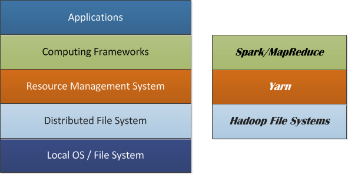
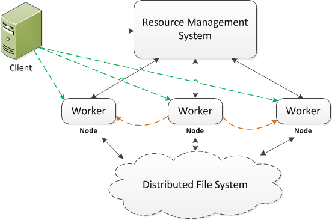

# DaaD - Deploy Application As Data

The distributed computing stack commonly uses a layered structure. It can be composed of local OS/FS, distributed FS, resource management system, distributed computing frameworks, and applications. Nowadays, the HDFS is often used as the distributed file system. Yarn is one example of the resource management systems, whereas Spark can one of promising computing frameworks. 



The key of distributed computing is to run the same code on the different parts of data and aggregate the results into the final solution. Particularly, the data are first partitioned, replicated and distributed across the cluster nodes. When an application is submitted by the client, the resource management system decides how much resource is allocated and where the code can be run (usually on the nodes where the input data are stored, so called data locality).  The computing framework devises a job or work plan for the application, which may be made up of tasks. More often than not a driver is issued in the client side (e.g., lines in green) or by a worker (e.g., lines in orange). The driver initializes the job and coordinates the job and tasks execution. Each task is executed by a worker running on the node and the result can be shuffled, sorted and copied to another node where the further execution would be done. 



Basically there are three approaches to deploy the application code for execution.
  
1. **Deploy the code in the cluster nodes** - This approach distributes the application to every node of the cluster and the client server. In other words, all involved nodes in the system have a copy of the application code. It is not common, but in some cases it is necessary when the application depends on the code running in the node. The disadvantages of this approach are obvious. First the application and the computing system have a strong coupling, such that any change from either side could potentially cause issues to the other. Second, the code deployment becomes very tedious and error prone. Think about the case where some nodes in the distributed environment fail during the code deployment. The state of cluster becomes unpredictable when those failed nodes come alive with the old version of code. 
2. **Deploy the code in the client server** - A more common strategy is to deploy the application code to client server only. When running the application, the code is first distributed to the cluster nodes with some caching mechanism, such as the distributed cache in Hadoop. This approach is simple but effective, decoupling the application and its underneath computing framework. However when the number of clients is large, the deployment can become nontrivial. Also if the size of application is very large, the job may have a long initialization process as the code needs distributing across the cluster. 
3. **Deploy the Application As Data** - In the distributed computing, the code and the data are traditionally treated differently. The data can be uploaded to the cloud and then copied and distributed by means of the file system utilities. However the code deployment is usually more complex. For example the network topology of application nodes must be well defined beforehand. A sophisticated sync-up process is often required to ensure the consistency and efficiency, especially when the number of application nodes is large. Therefore if the code can be deployed as data, the code deployment would become much simpler. In other words, the deployment only needs to upload the code to the distributed file system, just as common data files. While running the application, an application launcher independent of any applications is used to start copying the code to the distributed cache accessible to all application nodes, then trigger the job execution. There are some important advantages in the DaaD. First the deployment becomes much simpler and effective. The code is copied and distributed in the lazy way, when the first application depending on it is launched (In other word, it may cause some slowness when being used in the first time). Second the code consistency is guaranteed by the file system utilities. Third it makes it much easier for different code versions coexist in production. Image the case where it is necessary to run the same application with different versions for A-B test. It is possible to start the test from the same client machine. Next, I will use an example to show how the DaaD can help. 


## Deploy Application As Data

Here we use the HDFS as the distributed file system. We employ a typical MapReduce application, i.e., the wordcount job as an example.  We first copy its jar file to the HDFs. Then we define a launcher, which is a map-only MapReduce job, which doesn’t do anything but running the wordcount job. The steps are as follows:

1. Data preparation: We upload the data to the HDFS

		hadoop dfs -put /local/path/to/data/file /dfs/path/to/data/file

2. Application Code deployment: 
	* Programming - WordCount.java
		- To enable the configuration specification, it is necessary to implement org.apache.hadoop.util.Tool
	* Compiling and packaging by running the commands: 

		```
		$ export JAVA_HOME=/usr/java/default
		$ export PATH=${JAVA_HOME}/bin:${PATH}
		$ export HADOOP_CLASSPATH=${JAVA_HOME}/lib/tools.jar
		$ bin/hadoop com.sun.tools.javac.Main WordCount.java
		$ jar cf wc.jar WordCount*.class
		```
	* Upload the jar file to the HDFS

		hadoop dfs -put wc.jar /dfs/path/to/jar/file
		
3. Implement a launcher and deploy it in the client side (an implementation of the launcher can be found at https://github.com/turn/DaaD) 

4. Run the job from the client:

		hadoop jar /local/path/to/launcher/jar com.turn.utils.mapreduce.RunAppAsMapTask /dfs/path/to/jar/ WordCount /dfs/input/file /dfs/output/file

5. Check the progress and the result 
	* The launcher is a map-only job, whose single map task starts the wordcount job as another MapReduce job. 
	* 	The job progress can be found in the log of the launcher’s map task.
